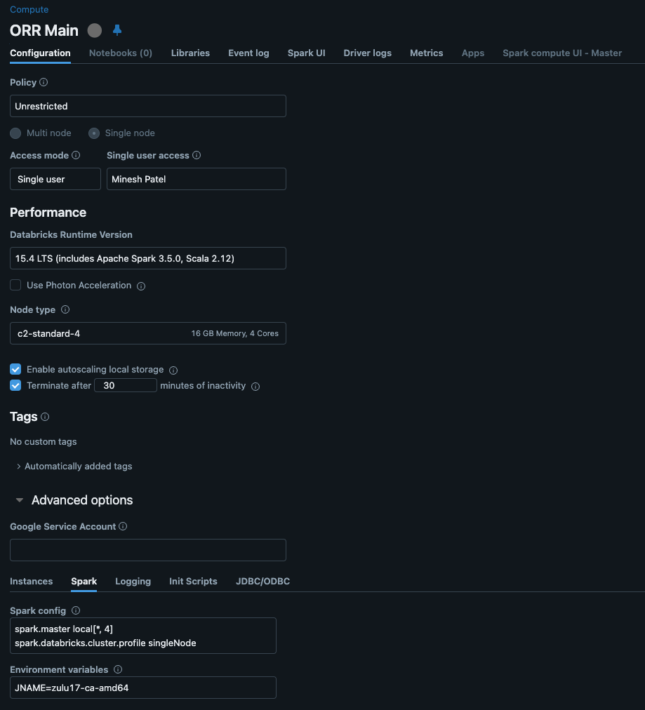
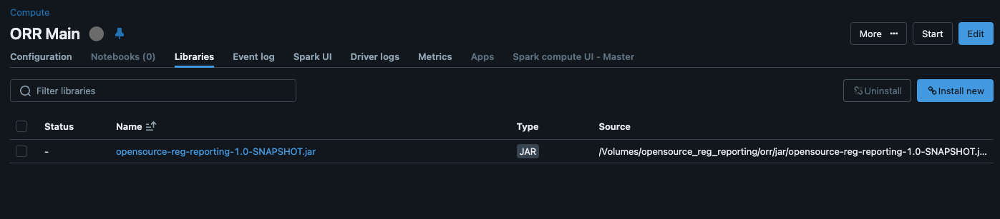
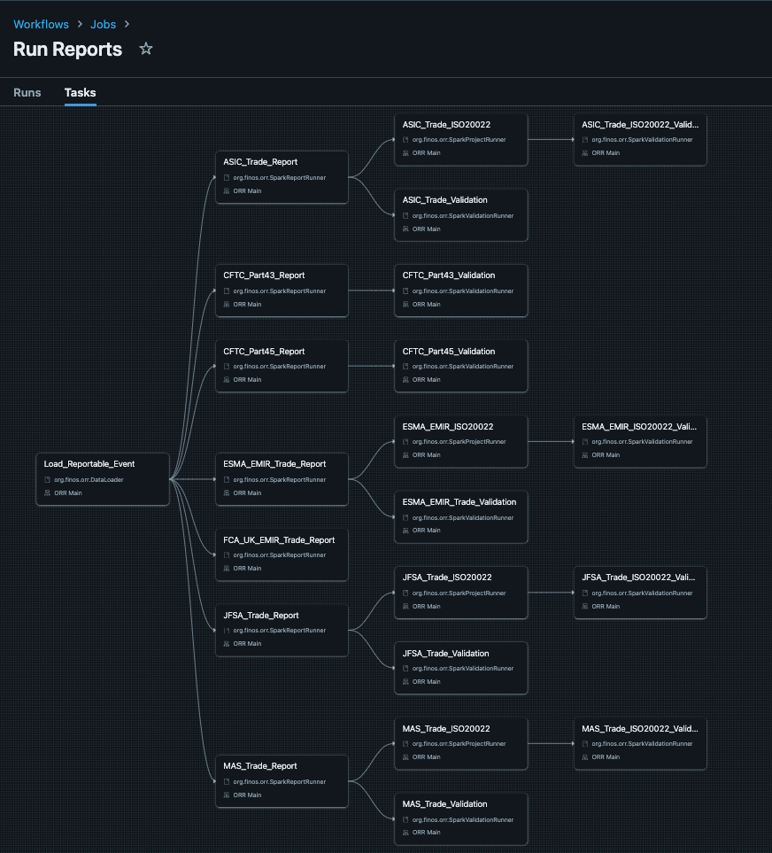
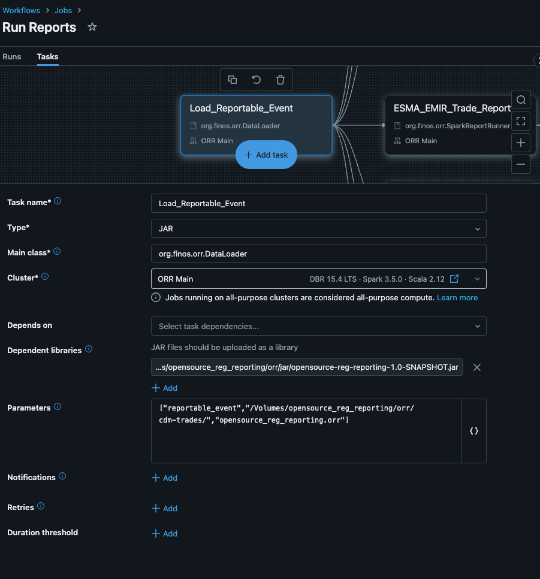
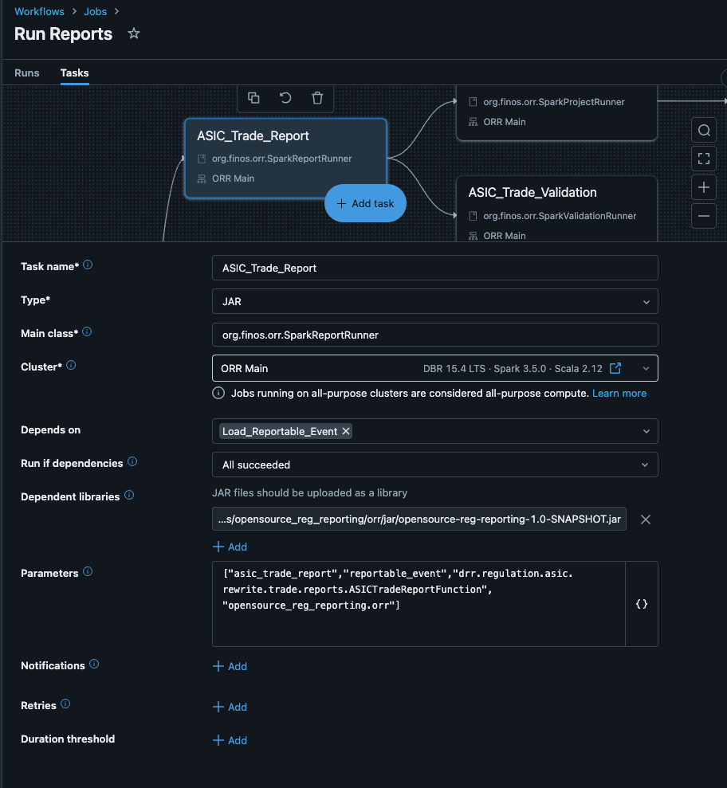
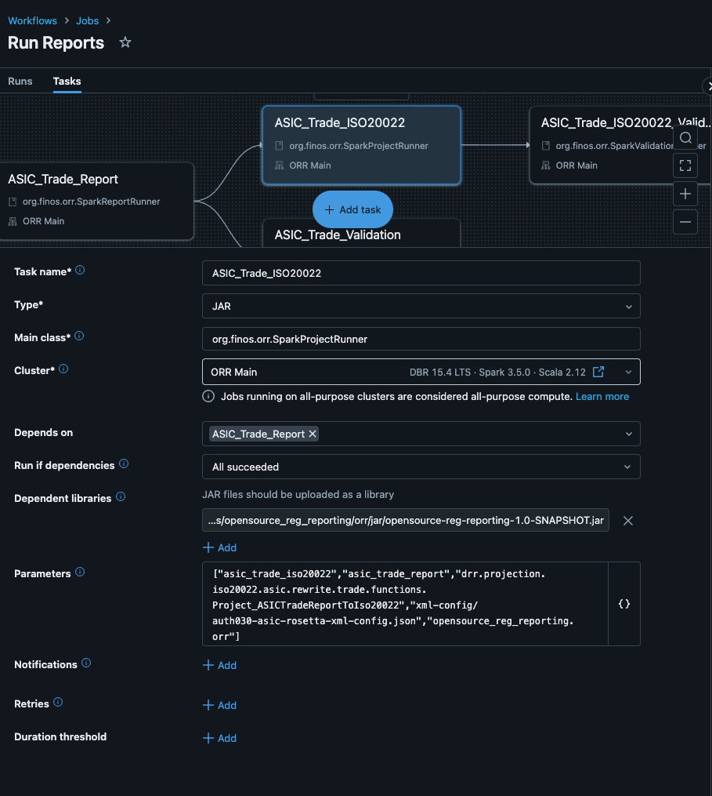
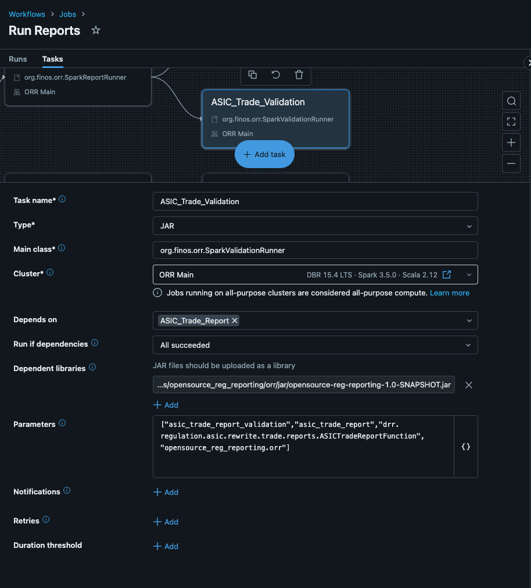

# Opensource Regulatory Reporting

[Insert Project Desc here]


## Prerequisites
- Basic Java, Maven and Git knowledge.
- Basic knowledge of [databricks](https://docs.databricks.com/en/index.html).
- **Databricks Cluster**: You need a running Databricks cluster with the appropriate Spark runtime version and libraries installed.
    - Get set up [here](https://docs.databricks.com/en/getting-started/community-edition.html)
- **Input Data**: The input data should be loaded into a Delta Lake table in the specified catalog and schema.
    - Download from the [DRR Distribution](https://drr.docs.rosetta-technology.io/source/download.html)
- **Application JAR**: The compiled JAR file of the project should be uploaded to a Databricks volume.
    - See section [Build the project](#build-the-project)
    - 
## Build

1. **Checkout the project:**
   ```bash
   git clone https://github.com/REGnosys/opensource-reg-reporting.git
   cd opensource-reg-reporting
   ```

2. **Build the project:**
   ```bash
   mvn clean install
   ```
   This will compile the code, run tests, and package the application into a JAR file located in the `target` directory called `opensource-reg-reporting-1.0-SNAPSHOT.jar`
   > **Note:** The project uses the Maven Shade plugin to create a "fat JAR" that includes all the necessary DRR (Data Regulatory Reporting) dependencies. The Apache Spark dependencies are marked as "provided" in the `pom.xml` file, as these will be available in the Databricks environment where the application will be deployed.

3. Applications in this Project
- **[DataLoader.java](src/main/java/org/finos/orr/DataLoader.java)**: Spark application to load data from a directory into a Spark table
    - **output-table**: Name of the output table.
    - **input-path**: The path to the directory containing the data files.
    - **catalog.schema**: Name of the database/schema.
- **[SparkReportRunner.java](src/main/java/org/finos/orr/SparkReportRunner.java)**: Spark application to run a Report (e.g. ESMA EMIR) and save the results on a Spark table
    - **output-table**: Name of the output table.
    - **input-table**: Name of the input table.
    - **function-name**: Fully qualified name of the Rosetta report function.
    - **catalog.schema**: Name of the database/schema.
- **[SparkProjectRunner.java](src/main/java/org/finos/orr/SparkProjectRunner.java)**: Spark application to run a Projection (e.g. ISO20022 XML) and save the results on a Spark table
    - **output-table**: Name of the output table.
    - **input-table**: Name of the input table.
    - **function-name**: Fully qualified name of the Rosetta projection function.
    - **xml-config-path**: Path to the XML configuration file.
    - **catalog.schema**: Name of the database/schema.
- **[SparkValidationRunner.java](src/main/java/org/finos/orr/SparkValidationRunner.java)**: Spark application to run a Validation report on either 1 or 2 Spark tables and save the results above and save the results on a Spark table
    - **output-table**: Name of the output table.
    - **input-table**: Name of the input table.
    - **function-name**: Fully qualified name of the Rosetta function to validate against.
    - **catalog.schema**: Name of the database/schema.

## Databricks Environment Setup

### Step 1: Create the Catalog
1. **Open Databricks SQL**:
    - Navigate to the Databricks workspace.
    - Click on the "SQL" icon on the sidebar.

2. **Create the Catalog**:
    - Run the following SQL command to create the catalog:
```
%sql
CREATE CATALOG opensource_reg_reporting;
```

### Step 2: Create the Schema
1. **Create the Schema**:
    - Run the following SQL command to create the schema within the catalog:

```
%sql
CREATE SCHEMA opensource_reg_reporting.orr;
```

### Step 3: Create the Volumes
1. **Create the Volumes**:
    - Run the following SQL commands to create the volumes:
```sql
%sql
CREATE VOLUME opensource_reg_reporting.orr.cdm_trades;
CREATE VOLUME opensource_reg_reporting.orr.jar;
```

### Step 4: Create the Compute Cluster
1. **Navigate to Compute**:
    - Click on the "Compute" icon on the sidebar.

2. **Create a New Cluster**:
    - Click on "Create Cluster".
    - Set the cluster name to "ORR Main".
    - Configure the cluster settings as needed (e.g., Databricks runtime version, node type, autoscaling options, etc.).
    - Fill in settings as per screenshot: 
    - Click "Create Cluster".

3. **Upload Applications Jar file to the cluster**
   - Select the Compute Resource
   - Click on `Libraries` tab
   - Click on `Install New` button to the top right
   - Select `Volumes`
   - Navigate to `/Volumes/opensource_reg_reporting/orr/jar`
   - Upload the Jar file from [Build the project](#build-the-project) section
   - The page should look like this: 

4. **Restart the cluster**

### Step 5: Create the Job

Each application can be run as a Spark job on Databricks. You can configure the job using the Databricks UI or a YAML configuration file. Here's a general outline of the steps involved:

This project includes four main Spark applications: `DataLoader`, `SparkProjectRunner`, `SparkReportRunner`, and `SparkValidationRunner`. These applications are designed to be run on a Databricks cluster and interact with data stored in a Delta Lake table.

#### **Pre-canned YAML Configuration**:

This is the quickest and easiest to get set up. See sections below for detailed set up.

Use the following YAML configuration to create the job and tasks:
- [job-run-reports.yaml](databricks/job-run-reports.yaml)

- click on `Workflows` on the left menu
- click `create job`
- click on the 3 dot menu on the top right hand side and `switch to code version (YAML)`.
- save the Job

#### Configuration Details
 
1. **Spark Jar Task**
   - Specifies the main_class_name as one of the following
     - org.finos.orr.DataLoader
     - org.finos.orr.SparkProjectRunner
     - org.finos.orr.SparkReportRunner
     - org.finos.orr.SparkValidationRunner
   - Set the jar to the location of the application JAR file in the Databricks volume.
2. **Parameters**
    - Each application requires specific parameters to be passed as arguments. Refer to the application's Javadoc for details on the required parameters.
3. **Configure Dependencies**
    - Add the application JAR as a library to the Spark job.
4. **Execute the Job**
    - Run the Spark job on the Databricks cluster.

> Note: Replace the placeholders (e.g., <output-table>, <input-table>, <function-name>, etc.) with the actual values for your environment.

```yaml
- task_key: <task-key>
  spark_jar_task:
    jar_uri: "<jar-uri>"
    main_class_name: <main-class-name>
    parameters:
      - <output-table>
      - <input-table>
      - <function-name>
      - <xml-config-path> (for SparkProjectRunner)
      - <catalog.schema>
    run_as_repl: true
  existing_cluster_id: <cluster-id>
  libraries:
    - jar: "<jar-uri>"
```

### *Setup using Databricks UI*:

#### Create Report Job



#### Create Load Data Task



#### Create Run Report Task



#### Create Run Project Task



#### Create Run Validation Task




## Limitations

TODO - Add section here
